**QR-Code Detection:** 

**Methods:** 

PyZbar: https://pypi.org/project/pyzbar/

OpenCv : https://docs.opencv.org/4.x/de/dc3/classcv\_1\_1QRCodeDetector.html Pyboof [:https://pypi.org/project/PyBoof/ ](https://pypi.org/project/PyBoof/)https://boofcv.org/index.php?title=Example\_Detect\_QR\_Code

Yolo: Pretrained Model was used but the dataset of the pre-trained model is unknown. 

1. **Demo** 

Methods were tested on PC according to the Dataset. 

**Accuracy Metric**: IoU 

**Dataset:** 1510 images (h[ttps://universe.roboflow.com/qr-lmsul/qr-code-detection - jz2e3/dataset/2) ](https://universe.roboflow.com/qr-lmsul/qr-code-detection-jz2e3/dataset/2)

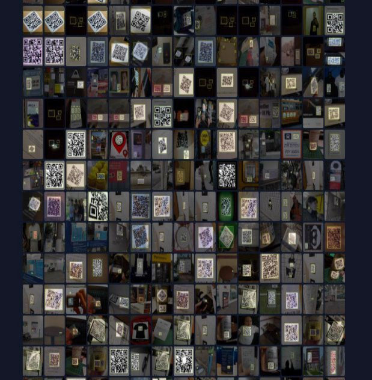

**Comprasion:** 

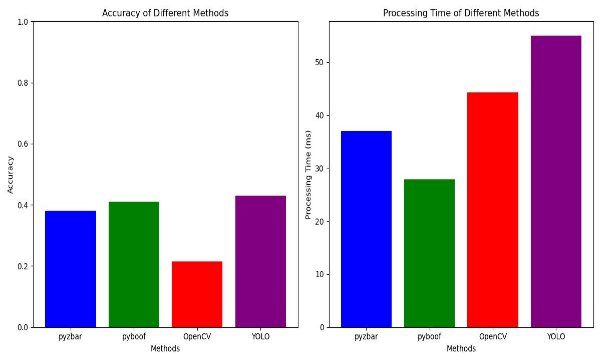

**Example Results: PyZbar:** 

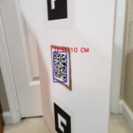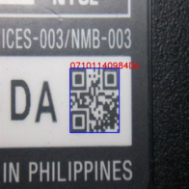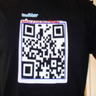

![ref1]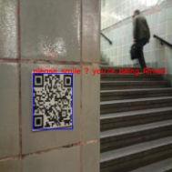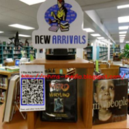

![ref2]![ref3]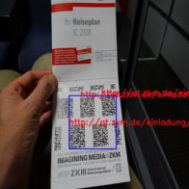

In the last example, it actually found 3 QR codes, but because of the way I chose to draw the bounding box, it seems like it found just one huge QR code.

**OpenCv :** 

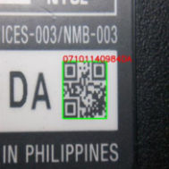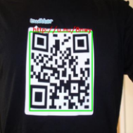![ref1]

![ref4]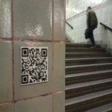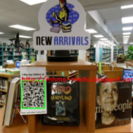

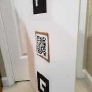![ref3]

**Pyboof:** 

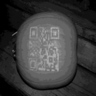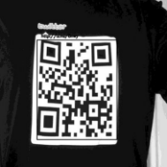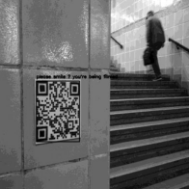

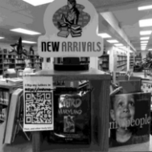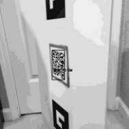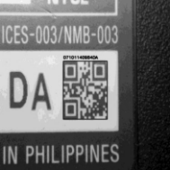

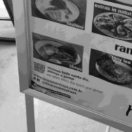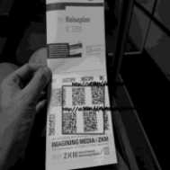

In the last example it found 4 qr codes.

**Yolo:** 

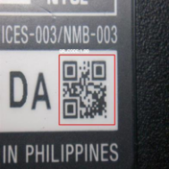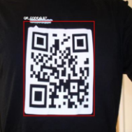![ref1]

![ref4]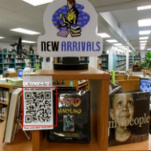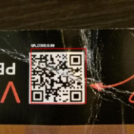

![ref2]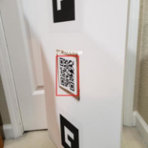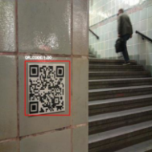

2. **Demo** 

Computer Camera was used instead of using dataset.

**OpenCV:** It is not successful in images shown far from the camera. It is less successful in images shown at an angle to the camera. It detects rotated images successfully.

**PyZbar:** It is not successful in images shown from far away. It is successful in images shown at an angle to the camera. It is successful up close. It detects rotated images successfully. 

**Yolo:** When I hold the picture very close, it can be found. Otherwise, it cannot be found. It often cannot distinguish two pictures side by side. Rotated pictures were 

successfully found. It is also successfull when shown at an angle. (Close-ups) 

**Pyboof:** Image (grayscale) fps is quite low. It can be said that it is successful in close - up and successful in small pictures (from a distance). Rotated is successful.

**Extra Comprasion:** [https://www.dynamsoft.com/codepool/qr-code-reading - benchmark-and-comparison.html ](https://www.dynamsoft.com/codepool/qr-code-reading-benchmark-and-comparison.html)

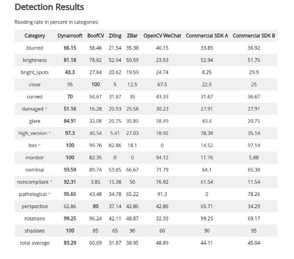

**Some Resources:** 

**Pyboof example:** <https://github.com/lessthanoptimal/PyBoof/tree/SNAPSHOT>

**Improvement (maybe for future ) : [https://github.com/Asadullah - Dal17/Improved_detection-with-Optical-Flow-distance-estimation ](https://github.com/Asadullah-Dal17/Improved_detection-with-Optical-Flow-distance-estimation)**

**Detection using Yolo:** [https://github.com/ErenKaymakci/Real-Time-QR-Detection - and-Decoding/blob/main/README.md ](https://github.com/ErenKaymakci/Real-Time-QR-Detection-and-Decoding/blob/main/README.md)

[https://github.com/yushulx/opencv-yolo-qr-detection ](https://github.com/yushulx/opencv-yolo-qr-detection)

**Different Dataset can be used:** https://www.kaggle.com/datasets/hamidl/yoloqrlabeled/data

[ref1]: Aspose.Words.fea68405-6f82-4366-b959-b2260c3225b1.006.png
[ref2]: Aspose.Words.fea68405-6f82-4366-b959-b2260c3225b1.009.png
[ref3]: Aspose.Words.fea68405-6f82-4366-b959-b2260c3225b1.010.png
[ref4]: Aspose.Words.fea68405-6f82-4366-b959-b2260c3225b1.014.png
